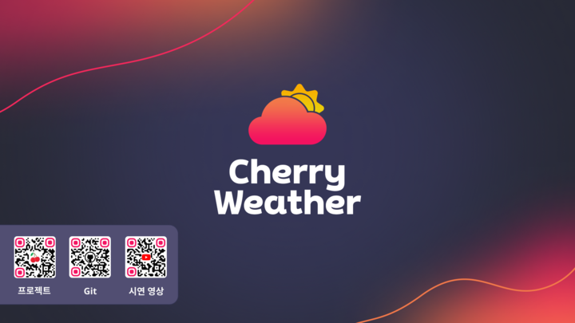
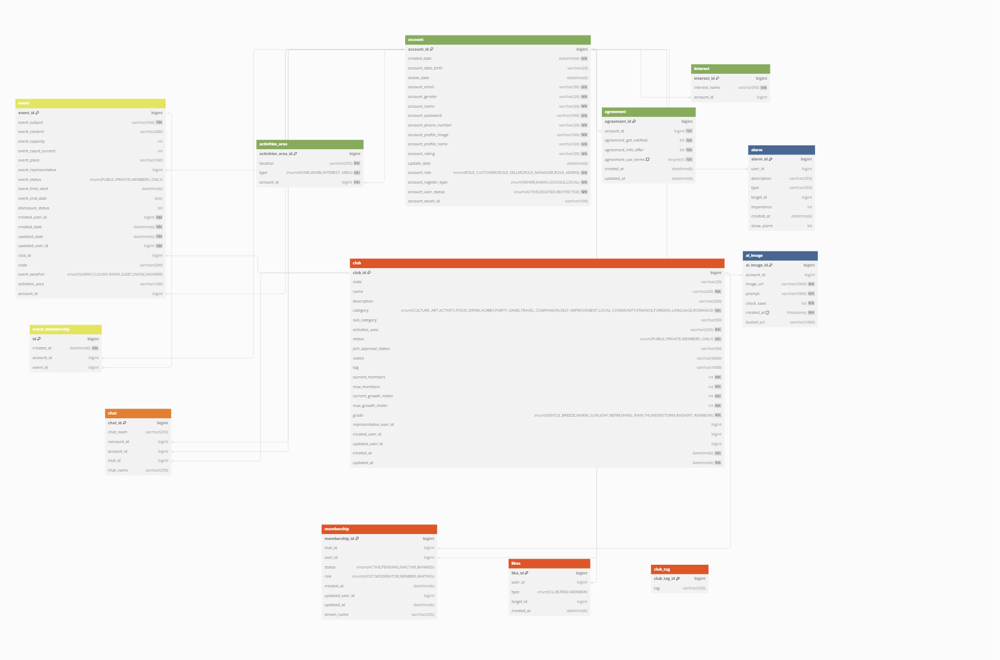
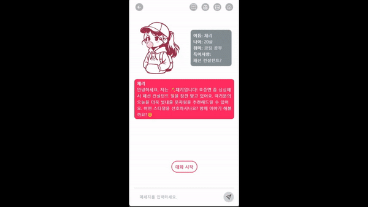
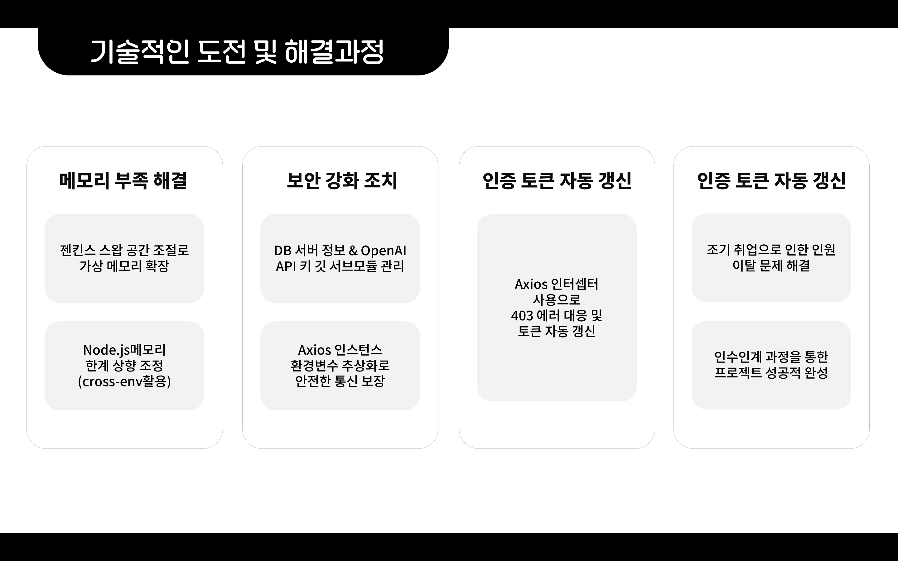

  

## 🗒️ 목차

- [서비스 개요](#✅-서비스-개요)
- [프로젝트 일정](#📅-프로젝트-일정)
- [DB ERD](#📗-DB-ERD)
- [기술 스택](#🔧-기술-스택)
- [기능 설명](#기능-설명)
- [시연 영상](#시연-영상)
- [트러블 슈팅](#트러블-슈팅)
- [팀 소개](#팀-소개)

## ✅ 서비스 개요

**🍒 체리 웨더 - 일상을 새롭게 디자인하는 날씨 플랫폼**

체리 웨더는 단순한 날씨 정보 제공을 넘어선, 통합된 생활 정보 플랫폼입니다. 날씨 예측부터, AI 기반의 맞춤 의상 추천, 커뮤니티 모임 관리, 직관적인 1:1 소셜 커뮤니케이션에 이르기까지 여러분의 일상을 한층 더 풍부하게 만들어 줄 다양한 기능을 하나의 플랫폼에서 제공합니다.

**주요 기능**

날씨 정보 및 예보: 실시간 날씨 업데이트와 정확한 예보를 통해, 하루를 더욱 효과적으로 계획하세요.
AI 기반 의상 추천: AI 채팅을 통해 사용자의 기호에 맞는 옷차림을 제안합니다. 또한 사용자가 원하는 제언을 이미지로 생성해서 제공할 수 있습니다.
커뮤니티 모임 생성 및 관리: 같은 관심사를 가진 사람들과 손쉽게 모임을 만들고, 관리할 수 있습니다.
소셜 커뮤니케이션: 1:1 채팅과 클럽내 단체 채팅 기능으로 커뮤니티 내에서의 소통을 강화합니다.

## 📅 프로젝트 일정

**2024년 1월 29일 ~ 3월 8일**

**1주차 (1.29 ~ 2.3):**

- **주제 설정 및 기능 정의**
  - 프로젝트 주제 설정 후 기능정의서를 바탕으로 화면정의서 작성
  - 피그마를 사용하여 대략적인 페이지 레이아웃 구성

**2주차 (2.4 ~ 2.17):**

- **핵심 기능 구현**
  - 웹 서비스의 핵심 기능을 포스트맨(Postman)을 활용해 구현
  - 리액트(React)를 이용하여 각 페이지 개발

**3주차 (2.18 ~ 2.25):**

- **인터페이스 및 디자인**
  - 인터페이스 구현과 페이지 디자인 작업을 통한 사용자 경험(UX) 개선

**4주차 (2.26 ~ 3.3):**

- **테스트 및 시연 준비**
  - 팀원 간 교차 테스트 실시
  - 시연 영상 제작

**5주차 (3.4 ~ 3.8):**

- **최종 발표 준비**
  - PPT 제작
  - 발표 리허설 및 준비 작업 (편집됨)

## 📗 DB ERD

## 🔧 기술 스택

<h4>의존성</h4>
스프링 부트는 여러 3rd party 라이브러리를 사용하여
starter라는 묶음 의존성 라이브러리 패키지를 이용하여
Maven/gradle에서 버전 관리를 하여 별도의 버전관리가 필요없고 간편하게 의존성을 지정할 수 있습니다.
<h4>내장 서버</h4>
스프링 부트는 내장 서버를 제공함으로써 별도의 서버 설치 없이도 애플리케이션을 실행할 수 있게 해줍니다. 이 내장 서버는 개발자가 애플리케이션 개발에만 집중할 수 있게 해주며, 배포 과정을 간소화시키는 데 큰 도움을 줍니다.
<h4>운영 편의성</h4>
스프링 부트는 애플리케이션의 상태 모니터링, 로깅, 보안 설정 등 운영에 필요한 기능들을 제공합니다. 이를 통해 애플리케이션의 운영과 관리가 편리해지고 안정성이 향상됩니다.

<h4>직관적인 API</h4>
스프링 부트는 애플리케이션의 상태 모니터링, 로깅, 보안 설정 등 운영에 필요한 기능들을 제공합니다. 이를 통해 애플리케이션의 운영과 관리가 편리해지고 안정성이 향상됩니다.

<h4>성능 최적화</h4>
리코일은 구독 기반의 상태 관리를 제공합니다. 이는 상태가 변경될 때 관련된 컴포넌트만 재렌더링되도록 해 성능 최적화에 기여합니다. 불필요한 재렌더링을 방지하면서도 상태 변화를 효과적으로 관리할 수 있습니다.

<h4>컴포넌트 간 상태 공유</h4>
리코일은 컴포넌트 간 상태를 쉽게 공유할 수 있게 해주며, 상태를 글로벌로 관리할 필요가 있는 복잡한 애플리케이션에 특히 유용합니다. 컨텍스트(Context) API나 프롭스 드릴링(Props Drilling) 없이도 상태를 공유할 수 있습니다.

<h4>모듈화와 재사용성</h4>
리코일의 상태와 로직은 재사용 가능한 단위로 쉽게 모듈화할 수 있습니다. 이는 큰 프로젝트에서 코드의 재사용성과 유지 보수성을 향상시키는 데 도움이 됩니다.

<h4>빠른 데이터 접근</h4>
Redis는 인메모리 데이터 스토어로, 디스크 기반의 데이터베이스에 비해 훨씬 빠른 데이터 읽기 및 쓰기를 제공합니다. 토큰 검증이나 갱신 작업 시, 사용자의 요청 처리 시간을 대폭 줄일 수 있습니다.

<h4>만료 처리 용이</h4>
Redis의 데이터 만료 기능을 사용하면 리프레시 토큰의 유효 기간을 쉽게 관리할 수 있습니다. 토큰에 대한 만료 시간을 설정해두면, Redis가 자동으로 만료된 토큰을 제거해줍니다. 이는 시스템의 자원을 효율적으로 관리하는 데 도움이 됩니다.

<h4>확장성</h4>
Redis는 확장성이 뛰어나서 대규모 사용자 기반을 가진 애플리케이션에도 적합합니다. 분산 시스템 환경에서 Redis 클러스터를 통해 데이터 분산과 복제를 관리할 수 있으며, 이를 통해 높은 가용성과 함께 트래픽 증가에 유연하게 대응할 수 있습니다.

<h4>보안성 향상</h4>
액세스 토큰과 리프레시 토큰을 Redis에 저장하면, 토큰의 노출 위험을 줄일 수 있습니다. 토큰을 클라이언트 측이 아닌 서버 측에서 관리함으로써, 토큰 탈취와 같은 보안 위협으로부터 보호할 수 있습니다. 또한, Redis는 SSL/TLS를 통한 데이터 암호화와 접근 제어 목록(ACL)을 지원하여 보안성을 더욱 강화할 수 있습니다.

<h4>세션 관리 용이</h4>
웹 애플리케이션에서 사용자 세션 정보를 Redis에 저장하면, 세션 정보의 빠른 조회와 관리가 가능합니다. 액세스 토큰과 리프레시 토큰의 상태를 실시간으로 확인하고 관리할 수 있어, 사용자 인증과 세션 관리를 더욱 효율적으로 수행할 수 있습니다.

<h4>중앙 집중식 토큰 관리</h4>
마이크로서비스 아키텍처와 같이 분산된 시스템 환경에서 Redis를 통해 토큰을 중앙 집중식으로 관리할 수 있습니다. 이는 토큰 관리의 복잡성을 줄이고, 시스템 전반의 인증 메커니즘을 통일할 수 있는 장점을 제공합니다.

<h4>개발 및 배포 속도 향상</h4>
자동화된 프로세스를 통해 소프트웨어 변경 사항을 더 빠르게 통합하고 배포할 수 있습니다. 이는 개발 팀이 새로운 기능을 사용자에게 더 빨리 제공할 수 있게 해주며, 시장에 신속하게 대응할 수 있는 능력을 향상시킵니다.

<h4>품질 보증</h4>
지속적인 테스팅과 통합을 통해 애플리케이션의 품질을 지속적으로 모니터링하고 보증할 수 있습니다. 자동화된 테스트는 개발 과정에서 발생할 수 있는 오류를 줄여주며, 제품의 안정성을 높여줍니다.

<h4>리스크 감소</h4>
CI/CD를 통해 작은 단위로 자주 배포함으로써, 각 배포에서 발생할 수 있는 리스크를 최소화합니다. 작은 변경 사항이라면 문제 발생 시 롤백하기도 더 쉬워집니다.

<h4>자동화를 통한 생산성 향상</h4>
배포 과정의 자동화는 반복적인 수동 작업을 줄여줍니다. 이로 인해 개발 팀은 코딩과 제품 개선에 더 많은 시간을 할애할 수 있으며, 전반적인 생산성이 향상됩니다.

<h4>자가 포함</h4>
JWT는 필요한 모든 정보를 자체적으로 포함하고 있습니다. 이 토큰에는 사용자에 대한 정보, 토큰의 발행자, 만료 시간 등이 포함되어 있어, 별도의 저장소에 접근하지 않고도 토큰을 통해 사용자 인증 및 정보 교환을 할 수 있습니다.

<h4>확장성</h4>
JWT는 세션 상태를 서버에 저장하지 않기 때문에, 서버의 자원을 절약할 수 있고, 이로 인해 시스템의 확장성이 향상됩니다. 각 요청마다 토큰이 전송되기 때문에, 서버나 서비스가 확장되어도 사용자 인증을 유지할 수 있습니다.

<h4>보안</h4>
JWT는 디지털 서명이 가능하기 때문에, 토큰의 내용이 변경되었는지 여부를 검증할 수 있습니다. 일반적으로 HMAC 알고리즘 또는 RSA의 공개키/개인키 쌍을 사용하여 서명됩니다. 이로 인해 정보의 위변조를 방지할 수 있습니다.

<h4>효율성</h4>
인증 정보를 각 요청마다 서버로 전송함으로써, 세션을 유지할 필요가 없어집니다. 이는 API 서비스나 분산된 마이크로서비스 아키텍처에서 효율적인 인증 방법을 제공합니다.

<h4>객체 지향적 데이터 접근</h4>
JPA를 사용하면 데이터베이스를 객체 지향적인 방식으로 쉽게 다룰 수 있습니다. 개발자는 데이터베이스 테이블을 직접 다루는 대신, 자바 객체(엔티티)를 통해 데이터를 조작할 수 있으며, JPA가 이러한 객체와 데이터베이스 테이블 간의 매핑을 관리합니다. 이로 인해 개발자는 객체 지향 프로그래밍(OOP)의 이점을 최대한 활용할 수 있습니다.

<h4>생산성 향상</h4>
JPA는 반복적인 CRUD(Create, Read, Update, Delete) 연산 코드를 대폭 줄여줍니다. JPA를 사용하면 복잡한 쿼리를 작성하고, 데이터베이스 연결 및 자원을 관리하는 등의 저수준 작업을 직접 처리할 필요가 없어, 개발자가 비즈니스 로직에 더 집중할 수 있게 됩니다.

<h4>데이터베이스 독립성</h4>
JPA는 데이터베이스에 독립적인 프로그래밍이 가능하도록 설계되었습니다. 이는 애플리케이션이 특정 데이터베이스에 종속되지 않도록 하며, 필요에 따라 데이터베이스를 교체할 때도 애플리케이션 코드의 대대적인 수정 없이 가능하게 합니다.

<h4>표준화</h4>
JPA는 자바 플랫폼의 공식 ORM 표준입니다. 다양한 JPA 구현체(예: Hibernate, EclipseLink, OpenJPA 등)를 사용할 수 있으며, 이들은 JPA 표준을 따르기 때문에, 애플리케이션을 다른 JPA 구현으로 쉽게 전환할 수 있습니다.

<h4>강력한 쿼리 언어 지원</h4>
JPA는 JPQL(Java Persistence Query Language)을 통해 복잡한 쿼리를 쉽게 작성할 수 있게 합니다. 이는 SQL과 유사하지만, 데이터베이스 테이블이 아닌 엔티티 객체에 대해 작업한다는 점에서 차이가 있습니다. 또한, Criteria API를 통해 타입-세이프 쿼리를 프로그래매틱하게 생성할 수 있습니다.

<h4>캐싱</h4>
JPA는 성능 최적화를 위해 1차 캐시와 2차 캐시를 지원합니다. 이를 통해 반복된 데이터 요청에 대해 빠르게 응답할 수 있으며, 데이터베이스 부하를 줄일 수 있습니다.

<h4>트랜잭션 관리 및 자동 변경 감지</h4>
JPA는 트랜잭션 관리를 쉽게 할 수 있게 도와주며, 엔티티의 상태 변경을 자동으로 감지하여 데이터베이스와 동기화합니다. 이로 인해 데이터 일관성을 유지하는 작업이 간편해집니다.

## 기능 설명

  
메인화면

- 현재, 일일, 주간 날씨
- 상세 날씨

  
마이페이지

- 회원 정보 수정, 알람 수신 동의, 미동의

  
클럽, 모임, 피드

  

- 클럽 가입 승인, 거절

- 모임 가입
<!--  -->

- 피드 쓰기
  

  
1대1채팅, 단체채팅

 

- 1:1 채팅

- 단체 채팅

  
알람기능

  

- 알람 기능
  

  
AI이미지 만들기

  

- AI 이미지 생성
  

## 시연 영상

**유튜브 링크**
**https://www.youtube.com/watch?v=S4SKvyfrk1Q**

## 트러블 슈팅

프로젝트를 진행하며 마주친 기술적인 문제와 그 해결 과정을 공유합니다.

### 첫 번째 문제: 메모리 부족 현상

- **상황**: 프로젝트 배포 과정에서 메모리 부족 현상이 발생
- **해결책**: 젠킨스 서버의 스왑 공간을 조절하여 가상 메모리 확장, 하드 드라이브 일부를 추가 메모리로 활용

### 두 번째 문제: Node.js 메모리 부족

- **상황**: 리액트 빌드 과정 중 Node.js 메모리 부족 문제 발생
- **해결책**: `cross-env` 사용하여 Node.js 프로세스 메모리 한계 확장, 빌드 및 배포 과정 성공적 완료

### 세 번째 문제: CI/CD 파이프라인과 보안 데이터 관리

- **상황**: CI/CD 파이프라인 구축 및 보안에 민감한 데이터 보호 필요
- **해결책**:
  - DB 서버 정보와 OpenAI API 키를 깃 서브모듈로 관리
  - Axios 인스턴스 설정으로 서버 요청 URL 환경변수로 추상화, 보안 강화

### 네 번째 문제: 인증 토큰 만료

- **상황**: 인증 토큰 만료로 인한 접근 문제
- **해결책**: Axios 인터셉터 사용, 403 에러 발생 시 토큰 자동 갱신 및 원래 요청 재수행

### 마지막 문제: 팀원 조기 취업으로 인한 인력 이탈

- **상황**: 팀원의 조기 취업으로 인한 인원 이탈
- **해결책**: 인수인계 과정을 통해 문제 해결, 담당 기능 성공적 완성

## 팀 소개

<b style = "font-size : 20px;">이소연</b> 
커뮤니티 및 전체 디자인 담당 
- 클럽, 클럽 상세, 피드, 멤버십, PPT 제작  

<b style = "font-size : 20px;">김요한</b> 
알람 및 Trello 일정 관리 담당 
- 커뮤니티,AI,회원과 연관된 알람 전반

<b style = "font-size : 20px;">김주영</b> 
회원 관리 시스템 담당 
- 회원가입, 소셜 로그인, 로그인, 회원정보 수정

<b style = "font-size : 20px;">박병철</b> 
날씨 정보 제공 및 메인 페이지 관리 
- 기상청 API, 날씨 상세, GitHub 관리

<b style = "font-size : 20px;">신영훈</b> 
AI 대화 및 이미지 생성 담당 
- GPT-3.5, DALL-E 3 이미지 생성, CI/CD, 영상 시나리오

<b style = "font-size : 20px;">윤현호</b> 
채팅 기능 전반 담당 
- 1:1 채팅, 단체채팅, 클럽 모임, CI/CD

